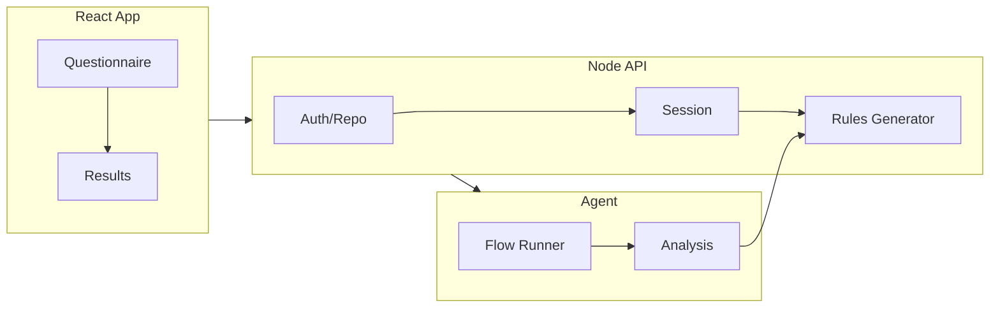

# Airules: AI Rules Generator – Overall Plan

This plan is the single source of truth for future agents building the airules app. The repo is currently empty; implementation should follow this structure and flow.

---

## 1. Product summary

- **Frontend (React):** Multi-step questionnaire with branching, “other” options, and optional “tell me more” per question. Final step shows/downloads a generated `rules` file (e.g. `rules.md` or equivalent) for the user’s chosen agent.
- **Backend (Node):** REST (or minimal GraphQL) API for questionnaire state, optional “analyze repo URL” (clone/read or use provider APIs), and rules generation. An **agent** runs the flow and performs final analysis (e.g. which rules to include, formatting).
- **Rules content:** Sourced from rule snippets you will provide later; the app combines them based on answers and agent decisions.

---

## 2. High-level architecture




- **React:** Collects answers step-by-step; optionally sends “repo URL” for analysis; receives generated rules and offers copy/download.
- **Node API:** Session/questionnaire storage, repo analysis (read-only), and orchestration of the agent and rules generator.
- **Agent:** Runs the questionnaire flow, decides which questions are relevant, performs final analysis (e.g. from repo contents), and instructs the rules generator which snippets and format to use.

---

## 3. Questionnaire model (core questions)

Implement these as the first version; each question supports **“other”** and an optional **“tell me more”** free text.


| #   | Question                      | Type                                                             | Purpose                                |
| --- | ----------------------------- | ---------------------------------------------------------------- | -------------------------------------- |
| 1   | Project type                  | Single: FE / BE / Data / Full-stack (monorepo)                   | Branching and which follow-ups to show |
| 2   | Frontend tech                 | Multi (or single): e.g. React, Vue, Svelte, Next, Remix, “Other” | FE-specific rules                      |
| 3   | Backend tech                  | Multi/single: e.g. Node, Python, Go, “Other”                     | BE-specific rules                      |
| 4   | Data layer                    | Multi/single: e.g. SQL, NoSQL, ORM names, “Other”                | Data/schema rules                      |
| 5   | Static site in repo?          | Yes/No (+ optional path)                                         | Static site rules / paths              |
| 6   | Docs website in repo?         | Yes/No (+ optional path)                                         | Docs structure / tooling               |
| 7   | Test framework                | Single/multi: e.g. Jest, Vitest, pytest, Mocha, Playwright, “Other” | Test-runner-specific rules          |
| 8   | When should agents run tests? | Multi: before responding / before commit / before push / never   | Test-related rules                     |


Extensible: add more questions later (e.g. monorepo structure, package manager, language versions) using the same pattern.

---

## 4. Repo analysis (optional)

- **Input:** User pastes repo URL (e.g. GitHub/GitLab).
- **Backend:** Either clone (shallow) to temp dir or use provider APIs (GitHub tree/content) to detect:
  - Presence of frontend (e.g. `package.json` with React/Vue, `next.config.*`, etc.)
  - Backend (e.g. `requirements.txt`, `go.mod`, `package.json` with Express/Fastify)
  - Data (e.g. `prisma`, `django`, `*migrations*`)
  - Static site (e.g. `docs/`, `storybook`, `docusaurus`)
  - Docs site (e.g. `docs/`, MkDocs, Docusaurus)
  - Test framework (Jest, Vitest, pytest, etc.) and where they’re run (scripts, CI)
- **Output:** Pre-filled answers for the questionnaire; “tell me more” can be left for the user. Agent uses this plus user overrides for final analysis.

---

## 5. Rules generation and agent flow

- **Snippets:** You will provide rule snippets later (e.g. per stack, per test strategy). Store them in the backend (e.g. `rules-snippets/` or DB) keyed by tags (e.g. `react`, `node`, `jest`, `pre-commit-tests`).
- **Agent responsibilities:**
  - Run the “flow”: given questionnaire answers (and optionally repo analysis), decide which snippets apply.
  - Final analysis: optionally refine choices using repo contents (e.g. prefer “Vitest” if repo has `vitest.config.*`).
  - Output format: choose format by “favorite agent” (Cursor vs Claude vs generic) and produce one rules file (e.g. Cursor: `rules.md` or `.cursor/rules/`; Claude: `claude.md` or project instructions).
- **Generator (Node):** Takes agent output (list of snippet keys + format) and assembles the final file; returns raw content to frontend for display and download.

---

## 6. Tech stack (recommended)

- **Frontend:** React (Vite), React Router for steps, minimal state (e.g. context or a small store) for questionnaire answers; no heavy UI framework required—keep it simple.
- **Backend:** Node (Express or Fastify), REST endpoints: e.g. `POST /api/session`, `GET/PATCH /api/session/:id`, `POST /api/analyze-repo`, `POST /api/generate-rules`. Optional: lightweight DB (SQLite or Postgres) for sessions if you want “save and resume” later.
- **Agent:** Implement as a backend “service” that receives answers + optional repo analysis, runs the flow (e.g. in process or via a small script), and returns snippet keys + format. Can be a separate process or the same Node process.
- **Testing (this repo):** Use one test framework for the whole repo (e.g. Vitest for client and server). Add unit and integration tests as features are built. Each phase should add or extend tests for the code it delivers. `npm run test` at root and in each workspace should run the suite.

---

## 7. File and folder structure (target)

```text
airules/
├── README.md                 # Project overview, how to run FE/BE/agent
├── docs/
│   └── PLAN.md              # This plan (or link to it)
├── client/                  # React app
│   ├── package.json
│   ├── vite.config.*
│   ├── index.html
│   ├── src/
│   │   ├── main.jsx
│   │   ├── App.jsx
│   │   ├── components/       # Questionnaire step, question, “other”, “tell me more”
│   │   ├── pages/           # Welcome, Questionnaire, Results (rules display + download)
│   │   ├── context/         # Questionnaire state
│   │   └── api/             # Client for backend
│   ├── src/**/*.test.jsx     # Client tests (Vitest)
│   └── ...
├── server/                  # Node backend
│   ├── package.json
│   ├── src/                  # incl. *.test.js for server tests (Vitest or Jest)
│   │   ├── index.js         # Express/Fastify app, routes
│   │   ├── routes/          # session, analyze-repo, generate-rules
│   │   ├── services/
│   │   │   ├── repoAnalyzer.js
│   │   │   ├── rulesGenerator.js
│   │   │   └── agentFlow.js  # Agent flow runner + final analysis
│   │   └── rules-snippets/  # Snippet files (to be added by you)
│   └── ...
└── package.json             # Optional root workspace (e.g. npm workspaces)
```

---

## 8. Implementation order for future agents

1. **Scaffold**
  - Root `package.json` (optional workspaces), `README.md`, and this plan in `ai/plans/PLAN.md`.
  - `client/`: Vite + React, router, minimal layout (steps indicator, next/back).
  - `server/`: Node + Express/Fastify, health route, CORS for `client`.
  - Test framework (e.g. Vitest) for client and server; `npm run test` in each workspace. Add tests as each feature is implemented.
2. **Questionnaire data model and UI**
  - Define questions (and branching logic) in a single source (e.g. `client/src/data/questions.js` or server-owned JSON).
  - Implement one question per step (or group where it makes sense); “other” and “tell me more” on each.
  - Persist answers in React state/context; optional: `POST /api/session` to save progress.
3. **Repo analysis**
  - `POST /api/analyze-repo` body: `{ url }`. Implement `repoAnalyzer` (clone or provider API), return structured detection result (project type, FE/BE/data, static/docs, tests). No secrets in repo; use env for tokens if needed.
4. **Rules snippets and generator**
  - Add `server/src/rules-snippets/` and a format for snippets (e.g. one file per tag or one manifest that references files). Implement `rulesGenerator.js`: given list of snippet keys + output format (Cursor/Claude/etc.), assemble and return the file content.
5. **Agent flow**
  - Implement `agentFlow.js`: input = questionnaire answers + optional repo analysis; output = list of snippet keys + chosen format. Logic: map project type + tech + test strategy to snippet keys; optionally override from repo analysis. Call `rulesGenerator` with that output.
6. **Generate and display rules**
  - `POST /api/generate-rules` with session id or full answers; server runs agent flow then generator; returns `{ content, filename }`. Frontend: Results page shows content in a code block and offers “Copy” and “Download” (e.g. as `rules.md`).
7. **Polish**
  - Pre-fill questionnaire from `/api/analyze-repo` when user pastes URL (e.g. “Load from repo” button). Optional: “Save and resume” with session id in URL or localStorage.

---

## 9. Out of scope (for later)

- Auth and multi-user accounts.
- Persisting generated rules in DB (only in-memory or session if at all).
- Editing snippets from the UI (snippets are maintained in repo by you).

---

## 10. Key contracts (for agents)

- **Session:** If implemented, use something like `{ id, answers, repoAnalysis?, createdAt }`. Answers shape: e.g. `{ projectType, frontendTech, backendTech, dataLayer, staticSite, docsSite, testFramework, testStrategy, otherFields, tellMeMore }`.
- **Analyze-repo response:** e.g. `{ projectType?, frontend?, backend?, data?, staticPath?, docsPath?, testFramework?, testRunner? }` — only fields that could be inferred.
- **Generate-rules request:** session id or full `answers` (+ optional `repoAnalysis`). Response: `{ content: string, format: "cursor" | "claude" | "generic", filename: string }`.

Future agents should follow this plan, implement in the order above, and extend the questionnaire and snippet set without changing these core contracts unless the product is explicitly expanded.

---

## 11. Phased approach for subagents

This section breaks the project into phases so that **one subagent (e.g. Sonnet-4.5) can execute one phase at a time**, in sequence. Each phase is self-contained, has clear inputs/outputs, and ends with a working increment.

**Handoff rule:** Each phase assumes the previous phase is complete. The subagent should read `docs/PLAN.md` (or this plan) and the current codebase before starting; it should not re-implement or conflict with prior work.

---

### Phase 1: Repository initialization

**Scope:** Create the repo structure and config. No runnable app yet.

**Tasks:**

- Initialize git (if not already). Create root `package.json` with npm workspaces for `client` and `server`.
- Add `.gitignore` (node_modules, .env, dist, .DS_Store, etc.).
- Create `README.md` with project description, link to plan, and placeholder "Getting started."
- Copy or link this plan into `ai/plans/PLAN.md` in the repo.
- Add basic tooling: `.editorconfig` and/or `.prettierrc` if desired.
- Add test framework (e.g. Vitest) to both client and server workspaces. Add `npm run test` scripts at root and in each package. No tests required yet; framework must be runnable.

**Deliverables:** Repo structure ready for Phase 2. `npm install` at root succeeds. `npm run test` runs (empty or single smoke test). No `client/` or `server/` app code yet—only workspace config.

**Agent instruction:** "Execute Phase 1 of the airules plan. Initialize the monorepo structure. Do not create client or server app code."

---

### Phase 2: Client scaffold and questionnaire UI

**Scope:** React app with full questionnaire flow. No backend; all state in memory.

**Prerequisites:** Phase 1 complete. `client/` workspace exists (create if Phase 1 only set up root).

**Tasks:**

- Scaffold `client/` with Vite + React. Add React Router.
- Define question data in `client/src/data/questions.js` per section 3 (all 8 core questions, including test framework, with "other" and "tell me more" support).
- Implement branching: hide FE questions if project type is BE/Data; hide BE questions if FE-only; etc.
- Build step-by-step questionnaire UI: one question per step (or grouped where logical), Next/Back, step indicator.
- Implement "other" (custom text input) and optional "tell me more" (textarea) on each question.
- Add a "Favorite AI agent" question: Cursor / Claude / Generic (for output format).
- Create a Results page that shows a placeholder: "Your rules will appear here." Include Copy and Download buttons (non-functional for now).
- Basic layout: Welcome/landing → Questionnaire → Results.
- Add tests for questionnaire components, question data, and branching logic (e.g. Vitest + React Testing Library).

**Deliverables:** `npm run dev` in `client/` runs the app. User can complete the questionnaire and reach Results. Client test suite runs and covers core questionnaire behavior. No API calls.

**Agent instruction:** "Execute Phase 2 of the airules plan. Build the full questionnaire UI with branching, 'other', and 'tell me more'. Results page shows placeholder only."

---

### Phase 3: Server scaffold and session API

**Scope:** Node backend with session endpoints. Client persists answers to backend.

**Prerequisites:** Phase 2 complete. Questionnaire UI works.

**Tasks:**

- Scaffold `server/` with Express or Fastify. Add CORS for client origin.
- Implement `POST /api/session` (create session, return `{ id }`). Store in memory (Map) or simple JSON file for now.
- Implement `GET /api/session/:id` and `PATCH /api/session/:id` (update answers).
- Add `GET /health` (or `/`) for health check.
- Create `client/src/api/` with a fetch wrapper. On questionnaire navigation, optionally PATCH session. On start, optionally POST to create session.
- Store session id in React state or localStorage. Persist answers to backend as user progresses (debounced or on step change).
- Add tests for session API (e.g. request handlers, create/GET/PATCH session). Use Vitest (or Jest) with a test HTTP client (e.g. supertest or fetch).

**Deliverables:** `npm run dev` in `server/` runs API. Client creates/updates sessions. Questionnaire state survives page refresh if session id is preserved (e.g. in URL or localStorage). Server test suite covers session endpoints.

**Agent instruction:** "Execute Phase 3 of the airules plan. Add the Node backend and session API. Connect the client to persist questionnaire answers."

---

### Phase 4: Rules snippets and generation (no repo analysis)

**Scope:** Generate real rules from questionnaire answers. No repo analysis yet.

**Prerequisites:** Phase 3 complete.

**Tasks:**

- Create `server/src/rules-snippets/` directory. Add a manifest (e.g. `manifest.json`) mapping snippet keys to file paths. Create placeholder snippet files for: `base`, `react`, `vue`, `node`, `python`, `sql`, `nosql`, `static-site`, `docs-site`, test frameworks (e.g. `jest`, `vitest`, `pytest`), `tests-before-respond`, `tests-before-commit`, `tests-before-push`, `cursor-format`, `claude-format`, `generic-format`.
- Implement `rulesGenerator.js`: given `{ snippetKeys: string[], format: "cursor"|"claude"|"generic" }`, load and concatenate snippets, return `{ content, filename }`.
- Implement `agentFlow.js`: input = `answers`; output = `{ snippetKeys, format }`. Use deterministic mapping: projectType + frontendTech + backendTech + dataLayer + staticSite + docsSite + testFramework + testStrategy → snippet keys. Use `format` from "favorite agent" answer.
- Add `POST /api/generate-rules` with body `{ sessionId }` or `{ answers }`. Run agentFlow, then rulesGenerator; return `{ content, filename }`.
- Update client Results page: on mount (or when reaching Results), call `POST /api/generate-rules` with current session/answers. Display content in a `<pre>` or code block. Wire Copy (clipboard) and Download (blob + anchor download).
- Add tests for rulesGenerator and agentFlow (unit tests). Add API test for `POST /api/generate-rules`. Optionally add client test for Results page behavior.

**Deliverables:** End-to-end flow works. User completes questionnaire → Results page shows generated rules → Copy and Download work. Tests cover rules generation and generate-rules API. No repo URL analysis.

**Agent instruction:** "Execute Phase 4 of the airules plan. Implement rules snippets, rulesGenerator, agentFlow, and the generate-rules API. Connect Results page to display and download rules."

---

### Phase 5: Repo analysis and pre-fill

**Scope:** Analyze repo URL and pre-fill questionnaire.

**Prerequisites:** Phase 4 complete.

**Tasks:**

- Implement `repoAnalyzer.js`: input `url` (GitHub/GitLab URL). Use GitHub API (or clone shallow) to fetch `package.json`, `requirements.txt`, `go.mod`, etc. Detect: projectType, frontend, backend, data, staticPath, docsPath, testRunner. Return structure matching "Analyze-repo response" in section 10.
- Add `POST /api/analyze-repo` with body `{ url }`. Call repoAnalyzer, return result. Add timeout and error handling (invalid URL, private repo, rate limit).
- Update `agentFlow.js` to accept optional `repoAnalysis`. When present, use it to override or refine snippet keys (e.g. prefer Vitest if repo has `vitest.config.*`).
- Add a "Paste repo URL" input on Welcome or first step. "Analyze" button calls `POST /api/analyze-repo`. On success, pre-fill questionnaire from response; user can edit before submitting.
- If using GitHub API, document `GITHUB_TOKEN` env var for higher rate limits. Do not commit tokens.
- Add tests for repoAnalyzer (e.g. with mocked API or fixture responses) and for `POST /api/analyze-repo`.

**Deliverables:** User can paste a repo URL, click Analyze, and see questionnaire pre-filled. Generated rules can incorporate repo-derived data. Graceful degradation if analysis fails. Tests cover repo analysis.

**Agent instruction:** "Execute Phase 5 of the airules plan. Implement repo analysis and pre-fill. Add 'Paste repo URL' and wire analyze-repo to questionnaire."

---

### Phase 6: Polish and production readiness

**Scope:** UX polish, error handling, and deployment prep.

**Prerequisites:** Phase 5 complete.

**Tasks:**

- Add loading states for analyze-repo and generate-rules. Show errors (e.g. toast or inline) when API fails.
- Add basic validation: require project type; require at least one tech when relevant. Disable "Next" or "Generate" when invalid.
- Improve step indicator (e.g. progress bar or numbered steps). Optional: allow jumping back to edit previous answers.
- Add a `Dockerfile` for the server (optional). Document `PORT` and `GITHUB_TOKEN` env vars.
- Add `npm run build` for client; ensure server can serve static client build or document separate hosting.
- Document deployment options: Vercel (client) + Railway/Fly/Render (server), or combined on a platform that supports both.
- Add a simple `CONTRIBUTING.md` or deployment section in README.
- Ensure full test suite passes. Add any missing tests for polish/validation paths. Document how to run tests in README.

**Deliverables:** App is production-ready: clear errors, validation, and deployment docs. Full test suite passes and is documented. Docker optional.

**Agent instruction:** "Execute Phase 6 of the airules plan. Add polish, error handling, validation, and deployment documentation."

---

### Phase 7: Deploy to production

**Scope:** Deploy client and server to a production environment.

**Prerequisites:** Phase 6 complete. Choose platform (e.g. Vercel + Railway, or Fly.io for both).

**Tasks:**

- Deploy server to chosen platform (Railway, Fly.io, Render, etc.). Set `PORT`, `GITHUB_TOKEN` (if used), `NODE_ENV=production`, and `CORS_ORIGIN` to client URL.
- Deploy client to Vercel, Netlify, or platform subdomain. Set `VITE_API_URL` (or equivalent) to server URL.
- Configure domain (if custom): e.g. `app.airules.dev` for client, `api.airules.dev` for server.
- Run smoke test: load app → complete questionnaire → generate rules → copy/download. Optionally test repo analysis with a public repo URL.
- Update README with live URL and deployment status.

**Deliverables:** App is live. README points to production URL. Smoke test passes.

**Agent instruction:** "Execute Phase 7 of the airules plan. Deploy client and server to production. Configure env vars and domain. Document live URL and run smoke test."

---

### Phase summary


| Phase | Name                            | Output                                     |
| ----- | ------------------------------- | ------------------------------------------ |
| 1     | Repository initialization       | Monorepo structure, no app code            |
| 2     | Client scaffold + questionnaire | Full questionnaire UI, placeholder results |
| 3     | Server + session API            | Persisted questionnaire state              |
| 4     | Rules snippets + generation     | End-to-end rules generation, copy/download |
| 5     | Repo analysis + pre-fill        | "Paste repo URL" pre-fills questionnaire   |
| 6     | Polish + production readiness   | Validation, errors, deployment docs        |
| 7     | Deploy to production            | Live app, smoke-tested                     |


Each phase should be assigned to a single subagent. The subagent reads the plan, checks the repo state, and executes only that phase's tasks.

---

## 12. Implementation notes (for later phases)

_This section is updated by each phase with decisions, deviations, and details that later phases or agents will find useful._

### Phase 1 (Repository initialization) — completed

- **Git:** Repository was initialized in Phase 1 (`git init`). No initial commit was made; agents may commit when ready.
- **Workspaces:** Root `package.json` uses npm workspaces with `"workspaces": ["client", "server"]`. Both `client/` and `server/` exist with **minimal** `package.json` files (name + private + version only) so that `npm install` at root succeeds. Phase 2 and Phase 3 will add real dependencies and scripts to these packages; do not remove the workspace entries.
- **Node:** Root package specifies `"engines": { "node": ">=18" }` for consistency.
- **Tooling:** `.editorconfig` and `.prettierrc` were added. Prettier is not installed as a dependency in Phase 1; Phase 2/3 may add it to client/server or root if desired.
- **Plan location:** The canonical plan may live in `docs/PLAN.md` or `ai/plans/PLAN.md`; this section (§12) should be kept in sync. Each phase should append its notes here.
- **Testing (retrofit):** Vitest was added to both workspaces. Root `package.json` has `"test": "npm run test --workspaces --if-present"`. Client uses Vitest with `environment: 'jsdom'` and `setupFiles: './src/test/setup.js'` (jest-dom for matchers). Server has `vitest.config.js` and a single smoke test in `server/test/smoke.test.js`. `npm run test` at root runs both client and server test suites.
- **Deviations:** None; Phase 1 matched the plan.

### Phase 2 (Client scaffold and questionnaire UI) — completed

- **Scaffold:** `client/` was scaffolded with Vite 5, React 18, and React Router 6. Entry: `index.html` → `src/main.jsx` → `App.jsx`. No `client/src/api/` folder yet (Phase 3 will add the API client).
- **Question data:** All 8 core questions (including test framework, per plan §3) plus “Favorite AI agent” are defined in `client/src/data/questions.js`. Exports: `QUESTION_IDS`, `QUESTION_ORDER`, `questions`, `questionsById`, `getVisibleQuestionIds(answers)`, `isQuestionVisible(questionId, answers)`.
- **Branching:** Visibility is driven by `projectType`. Frontend tech is shown only for `fe` and `fullstack`; backend tech and data layer only for `be`, `data`, and `fullstack`. Static site, docs site, test framework, test strategy, and favorite agent are always shown. The questionnaire step index is clamped when visible steps shrink (e.g. user goes back and changes project type).
- **Answers shape:** Aligned with plan §10. Multi-select fields (`frontendTech`, `backendTech`, `dataLayer`, `testFramework`, `testStrategy`) are arrays. Yes/no + path (`staticSite`, `docsSite`) are `{ yes: boolean | null, path: string }`. `otherFields[questionId]` and `tellMeMore[questionId]` hold per-question “other” text and optional “tell me more” text. Context lives in `client/src/context/QuestionnaireContext.jsx` (useReducer, no persistence).
- **UI:** One question per step. Each question supports “other” (custom text input when “Other” is selected) and optional “tell me more” (textarea) where the question config allows. Step indicator shows “Step X of Y”. Nav: “Back” / “Back to start” and “Next” / “Generate rules”. Results page shows placeholder “Your rules will appear here.” with Copy and Download buttons (non-functional until Phase 4).
- **Routes:** `/` (Welcome), `/questionnaire`, `/results`. No API calls; all state in memory.
- **Results page access:** Users can open `/results` directly without completing the questionnaire. For Phase 2 this is acceptable. Phase 4 will add validation/handling for missing or invalid session/answers when generating and displaying rules.
- **Testing (retrofit):** Client test suite uses Vitest + React Testing Library + jsdom. `client/src/test/setup.js` imports `@testing-library/jest-dom/vitest`. Tests added: (1) `client/src/data/questions.test.js` — question data exports, `isQuestionVisible` for all question ids and project types, `getVisibleQuestionIds` for empty/fe/be/fullstack and order preservation; (2) `client/src/components/StepIndicator.test.jsx` — step label and progressbar role; (3) `client/src/components/QuestionStep.test.jsx` — project type and multi-select/yesno/favorite agent rendering, selection updates context, unknown id returns null; selecting “Other” shows “Please specify” input and typing updates context; “Tell me more” textarea appears when enabled and typing updates context; (4) `client/src/pages/Questionnaire.test.jsx` — first step, step indicator, branching (Backend only → backend tech not frontend; Frontend only → frontend tech), Back button. Run with `npm run test` in `client/` or from root.
- **Deviations:** Plan suggests “docs/PLAN.md”; the repo uses `ai/plans/PLAN.md` from Phase 1. Phase 2 did not add an empty `client/src/api/` directory; Phase 3 will create it when adding the session API client.

### Phase 3 (Server scaffold and session API) — completed

- **Server scaffold:** Express with `cors` and `express.json()`. Entry point `server/src/index.js` exports `app` for tests and starts the server when run directly (`node src/index.js` or `npm run dev`). Port from `PORT` env (default 3000). CORS uses `CORS_ORIGIN` env or `true` (reflect request origin). Health check: `GET /health` returns `{ status: "ok" }`.
- **Session store:** In-memory `Map` in `server/src/store/sessionStore.js`. Session shape per plan §10: `{ id, answers, repoAnalysis?, createdAt }`. Answers shape matches client (projectType, frontendTech, backendTech, dataLayer, staticSite, docsSite, testFramework, testStrategy, favoriteAgent, otherFields, tellMeMore). `createSession(answers?)`, `getSession(id)`, `updateSession(id, updates)`. `clearSessions()` exported for tests only.
- **Session routes:** `POST /api/session` (body optional `{ answers }`) → 201 `{ id }`. `GET /api/session/:id` → 200 session or 404. `PATCH /api/session/:id` (body `{ answers?, repoAnalysis? }`) → 200 updated session or 404. PATCH merges `updates.answers` into existing session.answers (shallow merge).
- **Client API:** `client/src/api/client.js` provides `createSession(body?)`, `getSession(id)`, `updateSession(id, body)`, and `getBaseUrl()`. Base URL from `VITE_API_URL` (default `http://localhost:3000`). All request/response JSON; errors throw with `status` and `body`.
- **Context changes:** `QuestionnaireContext` now exposes `sessionId` and `setSessionId` in addition to `answers` and `dispatch`. New reducer action `RESTORE` sets state from payload (merge with initialState). Session id is persisted to `localStorage` under key `airules_session_id`; initial `sessionId` state is read from localStorage.
- **Questionnaire persistence:** On mount, if `sessionId` is set (e.g. from localStorage after refresh), `GET /api/session/:id` is called and answers are restored via `RESTORE`. If no `sessionId`, `POST /api/session` creates one and `setSessionId(id)` is called. On every step change (Next, Back, or "Generate rules"), `PATCH /api/session/:id` is called with current `answers` (fire-and-forget; no loading UI). Thus questionnaire state survives page refresh when session id is in localStorage.
- **Scripts:** Server has `npm run dev` (node with `--watch`) and `npm run start`. Root `npm run test` runs both client and server suites.
- **Testing (server):** Vitest + supertest. `server/src/routes/session.test.js` covers: GET /health, POST /api/session (create, with optional answers), GET /api/session/:id (200 with body, 404 for missing), PATCH /api/session/:id (update answers, 404 for missing). Store is cleared between tests via `clearSessions()`. Client tests were not changed; they do not mock the API, so when running without a server, createSession fails and the app continues with local state only.
- **Decisions:** Chose Express over Fastify. Persist on step change (not debounced per-answer) to limit request volume. Session id in both context and localStorage so that refresh rehydrates without requiring URL params.
- **Deviations:** None; behavior matches Phase 3 scope. Phase 4 can use session id or full answers for `POST /api/generate-rules`.

### Phase 3 — Client UI (questionnaire flow and layout)

Implementation notes for the questionnaire UI and layout built alongside Phase 3 (single-page flow, stack, theme, orb, results as card).

- **Single-page flow:** No React Router. App state is `screen: 'questionnaire' | 'results'` (results screen was removed; see below). Default screen is `questionnaire`. Header “home” resets to first question (`startAtStep = 0`, `screen = 'questionnaire'`).
- **First screen:** App opens on the first question. Intro text (“Get better results from your coding agent…”) is shown above the first card, vertically centered in the space above the card; first question and all others use the same card + nav layout.
- **Progress bar:** Step indicator is a progress bar only (no “Step X of Y” text). Filled segment has a subtle glow (`box-shadow`), can overflow the track (no `overflow: hidden` on the container). `StepIndicator` receives `currentStep` and `totalSteps`; on Back, `currentStep` is set to `stepIndex - 1` during exit so the bar animates in sync with the cards.
- **Stack (no scroll):** All steps are rendered as overlapping “slots” (position absolute, same area). Only current + past steps are in the DOM: `stackIds = stepIndex < visibleIds.length ? visibleIds.slice(0, stepIndex + 1) : [...visibleIds, RESULTS_STEP_ID]`. Each slot has `--stack-offset: stepIndex - i` (or when exiting, `stepIndex - 1 - i` so all past cards move forward together). Past cards recede: `translateY(-40px * offset)`, `scale(1 - offset * 0.12)`, reduced opacity and box-shadow (no white glow). Transform order: translate then scale; `transform-origin: center top` so they don’t drift down. Intro text fades out when the first card is in the past (`opacity: calc(1 - var(--stack-offset))`).
- **Back transition:** On Back, `isExiting` is set; current card gets `--exiting` and fades out; all past cards get new `--stack-offset` so they move forward at once. After 320ms, `stepIndex` is decremented. “Returned from back” state skips fade-in on the card we return to. Progress bar shows target step during exit.
- **Forward transition:** When advancing, the new current card fades in (CSS animation). Fade-in is not applied when the card becomes current via Back (`returnedFromBack` + `questionnaire-step-slot--returned-from-back`).
- **Results as final card:** Results are the last card in the stack, not a separate screen. `totalSteps = visibleIds.length + 1`. When user completes the last question, `stepIndex` is set to `visibleIds.length`; `stackIds` includes `RESULTS_STEP_ID` and the Results card is rendered in a slot. `ResultsCard` (card content only) is exported from `Results.jsx` and used in the stack; “Back to questionnaire” label was changed to “Start Over”, white text, underline style. Recede/exit/fade-in CSS applies to `.results-card` in slots as well. App no longer has a `results` screen; only the questionnaire view is used.
- **Nav:** Back (icon only) is hidden on the first card (`!isFirst`). Next and Skip are icon/text; Skip is centered between Back and Next. On the results card, only Back is shown (no Skip, no Next). Back and Next use the same gray style (`#0f0f0f` / `#1a1a1a`); Back is darker. Icons are inline SVG chevrons (20×20).
- **Cards:** One card per step (no nested card). Cards use black background, white border, subtle white glow (`box-shadow`). “Other” option expands with animated height (max-height transition). Placeholders: “Please describe…” for other, “Optional - add more context” for tell me more (no “Tell me more” heading).
- **Theme:** Light/dark/system toggle in header via `ThemeContext`; default dark. No flash: inline script in `index.html` sets a class from localStorage before paint.
- **Orb:** Talos-style orb in header (`client/src/components/orb/`: Orb.jsx, OrbDisplay.jsx, icons, OrbContext). Header orb is clickable: click calls `orbRef.current.randomize()`. Header orb container must not have `pointer-events: none` (removed so clicks work). Cursor pointer on the orb container.
- **Layout:** Starfield background (canvas, gradient, subtle star motion). Header: fixed height, black, orb left, “AI Rules Generator” center, theme toggle right. Footer black, light text. Content area uses flex; stack container has `--questionnaire-scroll-height` set via ResizeObserver for slot min-height.
- **Files (main):** `App.jsx`, `Questionnaire.jsx`, `Results.jsx` (ResultsCard + RESULTS_STEP_ID), `Welcome.jsx` (unused; app opens on questionnaire), `QuestionStep.jsx`, `StepIndicator.jsx`, `index.css`, `SiteHeader.jsx`, `SiteFooter.jsx`, `StarfieldBackground.jsx`, `ThemeContext.jsx`, `ThemeToggle.jsx`, `OrbContext.jsx`, `components/orb/*`.

### Phase 4 (Rules snippets and generation) — completed

- **Snippets location:** Snippets live under `server/snippets/`, not `server/src/rules-snippets/`. The plan’s “rules-snippets” is implemented as `server/snippets/`: manifest at `server/snippets/manifest.json`, placeholder snippets in `server/snippets/*.mdc`, and references to `server/snippets/awesome-cursorrules/rules-new/*` and `rules/*` for awesome-cursorrules content.
- **Manifest:** `server/snippets/manifest.json` maps logical keys (e.g. `base`, `react`, `vue`, `nextjs`, `node-express`, `python`, `sql`, `nosql`, `jest`, `vitest`, `pytest`, `static-site`, `docs-site`, `tests-before-respond`, `tests-before-commit`, `tests-before-push`) to paths relative to `server/snippets`. Paths point to our own placeholders and to files inside `awesome-cursorrules/rules-new/` and `awesome-cursorrules/rules/<folder>/.cursorrules`. No separate “cursor-format” / “claude-format” snippet files; format only affects the output filename.
- **rulesGenerator.js:** `server/src/services/rulesGenerator.js`. Loads manifest (cached), resolves paths from `server/snippets`, reads each snippet file, concatenates with `\n\n---\n\n`. Returns `{ content, filename }`. Filename from format: cursor/claude → `rules.md` / `claude.md`; generic → `rules.md`. Unknown keys or missing files are skipped (no throw). Empty snippetKeys produces fallback text “No rules selected”.
- **agentFlow.js:** `server/src/services/agentFlow.js`. Input: session `answers` (current shape: projectType, frontendTech, backendTech, dataLayer, staticSite, docsSite, testFramework, testStrategy, favoriteAgent). Output: `{ snippetKeys, format }`. Deterministic mapping: always `base`; frontend (fe/fullstack) → react, vue, svelte, nextjs from frontendTech; backend (be/fullstack/data) → node-express, python from backendTech; typescript added when react/next or node; dataLayer sql/prisma → sql, nosql → nosql; staticSite/docsSite yes → static-site, docs-site; testFramework → jest, vitest, pytest; testStrategy → tests-before-respond, tests-before-commit, tests-before-push; format from favoriteAgent (cursor|claude|generic, default cursor). Dedupes snippet keys. Does not include FastAPI by default when Python is selected (no question for “Python framework” yet).
- **Generate-rules route:** `POST /api/generate-rules` in `server/src/routes/generateRules.js`. Body: `{ sessionId }` or `{ answers }`. If sessionId, loads session and uses session.answers; else uses body.answers. 400 if neither; 404 if sessionId not found. Runs runAgentFlow(answers) then generateRules({ snippetKeys, format }), returns `{ content, filename }`.
- **Client:** `client/src/api/client.js` has `generateRules(body)` (POST /api/generate-rules). Results card (`Results.jsx`): on mount calls generateRules({ sessionId }) or generateRules({ answers }) once, shows “Generating…”, then content in `<pre>` or error message. Copy button writes content to clipboard; Download button creates a blob and triggers download with returned filename. “Start Over” unchanged.
- **Decisions:** (1) Snippets directory is `server/snippets/` so that awesome-cursorrules can live as a sibling to our placeholders and manifest. (2) agentFlow uses the existing questionnaire answer shape (Phase 2/3); when the app adopts the schema in `questions.json` (ai/plans), a later phase can add answer normalization or a second mapping. (3) Results fetch runs once on mount (empty effect deps) to avoid refetch loops; sessionId/answers are read from context at that time.
- **Deviations:** Plan suggested “server/src/rules-snippets/”; we used `server/snippets/` and kept awesome-cursorrules there. Plan listed “cursor-format”, “claude-format”, “generic-format” as snippet keys; we only use format for the output filename, not as loadable snippets.
- **Testing:** `server/src/services/agentFlow.test.js` (runAgentFlow: null/empty, frontend/backend/data/test/static/docs, format, dedupe). `server/src/services/rulesGenerator.test.js` (empty keys, base key, format filenames, concatenation, unknown key). `server/src/routes/generateRules.test.js` (400 no body, 404 bad sessionId, 200 with sessionId, 200 with answers). No new client tests for Results (optional per plan).

### questions.json / questions.md migration (schema-driven questionnaire + full rules pipeline) — completed

- **Scope:** Full replace of the original 8-question flow with the schema-driven questionnaire and tagged snippet selection per `ai/plans/questions.md` and `server/questions.json`. Validation is server-only; client displays validation errors returned by the API.
- **Schema API:** `GET /api/questionnaire-schema` returns the full JSON Schema from `server/questions.json` (including `x-other` for the client). Implemented in `server/src/routes/schema.js`; schema loaded from `server/src/schema/loadSchema.js`.
- **Validation:** `server/src/schema/validate.js` uses AJV (Draft 2020-12 via `ajv/dist/2020.js`) with a stripped copy of the schema (all `x-*` keys removed) so the validator ignores custom keywords. `validateAnswers(answers)` returns `{ valid, errors }` with `errors: [{ field?, message }]`. Used in `PATCH /api/session/:id` (400 + errors when invalid) and `POST /api/generate-rules` (400 + errors when invalid).
- **Session store:** `getEmptyAnswers()` now returns `{}`; session answers are a flat object keyed by schema property names (e.g. `repo_type`, `languages`, `frontend_framework`). No more `projectType` / `frontendTech` / `otherFields` / `tellMeMore`.
- **Answer→tag config:** `server/snippets/answer-tag-config.json` maps answer keys/values to desired tags (e.g. `languages` + `ts_js` → `lang:ts_js`, `frontend_framework` + `next_app_router` → `frontend:nextjs`, `next_router:app_router`). Used by `server/src/services/tagQuery.js` (`buildTagQuery(answers)`).
- **Tagged manifest:** `server/snippets/tagged-manifest.json` lists snippets with `id`, `path`, `tags[]`, `family` and `familyOrder`. Used by `server/src/services/snippetSelector.js` (`selectSnippets(tagQuery)`): score by tag match, cap per family, return ordered snippet ids.
- **Base rules:** `server/src/services/baseRulesGenerator.js` turns process answers (ai_permissions, always_ask_before, git_behavior, when_run_checks, failure_policy, documentation_expectations, security_posture, output_preference, uncertainty_handling) into simple markdown bullets. Injected at the top of generated content when using new-schema answers.
- **agentFlow:** Detects new-schema answers via `answers.repo_type !== undefined`. For new schema: builds tag query, runs snippet selection, generates base rules, returns `{ snippetKeys, format, baseContent }`. For legacy (old) answers still returns `{ snippetKeys, format }` via `runAgentFlowLegacy`. `rulesGenerator.generateRules` accepts optional `baseContent` and prepends it.
- **Client (schema-driven UI):** Questionnaire fetches schema via `getQuestionnaireSchema()` from `client/src/api/client.js`. `client/src/data/schemaQuestions.js` provides `getOrderedFieldIds(schema)`, `getDefaultAnswers(schema)`, `isMultiSelect` / `isSingleSelect`, `getOptions`, `getXOther`, `hasNoneExclusivity`. Field order is a fixed list (repo_type, repo_layout, …) for the step flow; companion `*_other_text` fields are not separate steps—they render inline when “Other” is selected.
- **SchemaQuestionStep:** `client/src/components/SchemaQuestionStep.jsx` renders one schema property: single/multi from schema type and enum, “Other” + companion text input when `x-other` is present (companion cleared when user deselects “Other”), and “none” exclusivity for multi-selects (selecting “none” clears others; selecting another clears “none”). Replaces the old `QuestionStep` for the main flow; `QuestionStep.jsx` remains in the repo but is no longer used by `Questionnaire.jsx`.
- **Context:** `QuestionnaireContext` state is a single flat `answers` object; the only action is `SET_ANSWER` with `{ fieldId, value }`. No `otherFields` or `tellMeMore`; companion fields are normal keys (e.g. `languages_other_text`).
- **Questionnaire page:** On mount fetches schema; when schema is loaded, gets ordered field ids and defaults. Session init: if `sessionId` exists, `GET /api/session/:id` and restore answers (or defaults if empty); else `POST /api/session` and apply schema defaults. Persists on step change via `PATCH /api/session/:id`; on 400, stores `validationErrors` and shows them in a block above the stack. Uses `SchemaQuestionStep` for each step.
- **Visibility:** Conditional visibility (e.g. hide styling when frontend is “none”) was deferred; it will be driven by dependencies in `questions.json` in a later phase. All schema fields are shown in the fixed order.
- **Tests:** Server: `schema.test.js` (GET questionnaire-schema returns schema with x-other). Session and generate-rules tests updated to use `validMinimalAnswers()` (new schema shape); validation failure tests added. Client: `Questionnaire.test.jsx` mocks `getQuestionnaireSchema` with `minimalSchema` fixture and tests loading, first step (Repo type), progress bar, and Back. Old `QuestionStep.test.jsx` removed (component unused).
- **Decisions:** (1) AJV 2020-12 via `ajv/dist/2020.js` so the schema’s `$schema` is supported. (2) Single response for generate-rules (one content string); `rules_file_structure` does not change API shape. (3) Base rules are simple bullets, not templated prose. (4) Tagged manifest is a curated subset (same ids as in manifest.json) rather than an auto-built index of all awesome-cursorrules folders.