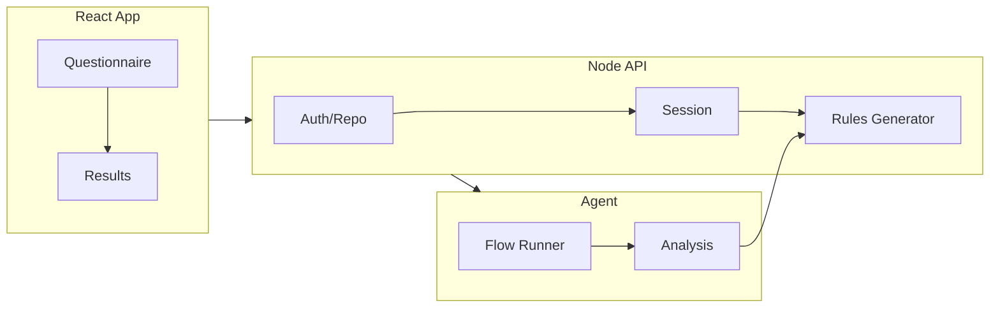

# Airules: AI Rules Generator – Overall Plan

This plan is the single source of truth for future agents building the airules app. The repo is currently empty; implementation should follow this structure and flow.

---

## 1. Product summary

- **Frontend (React):** Multi-step questionnaire with branching, “other” options, and optional “tell me more” per question. Final step shows/downloads a generated `rules` file (e.g. `rules.md` or equivalent) for the user’s chosen agent.
- **Backend (Node):** REST (or minimal GraphQL) API for questionnaire state, optional “analyze repo URL” (clone/read or use provider APIs), and rules generation. An **agent** runs the flow and performs final analysis (e.g. which rules to include, formatting).
- **Rules content:** Sourced from rule snippets you will provide later; the app combines them based on answers and agent decisions.

---

## 2. High-level architecture




- **React:** Collects answers step-by-step; optionally sends “repo URL” for analysis; receives generated rules and offers copy/download.
- **Node API:** Session/questionnaire storage, repo analysis (read-only), and orchestration of the agent and rules generator.
- **Agent:** Runs the questionnaire flow, decides which questions are relevant, performs final analysis (e.g. from repo contents), and instructs the rules generator which snippets and format to use.

---

## 3. Questionnaire model (core questions)

Implement these as the first version; each question supports **“other”** and an optional **“tell me more”** free text.


| #   | Question                      | Type                                                             | Purpose                                |
| --- | ----------------------------- | ---------------------------------------------------------------- | -------------------------------------- |
| 1   | Project type                  | Single: FE / BE / Data / Full-stack (monorepo)                   | Branching and which follow-ups to show |
| 2   | Frontend tech                 | Multi (or single): e.g. React, Vue, Svelte, Next, Remix, “Other” | FE-specific rules                      |
| 3   | Backend tech                  | Multi/single: e.g. Node, Python, Go, “Other”                     | BE-specific rules                      |
| 4   | Data layer                    | Multi/single: e.g. SQL, NoSQL, ORM names, “Other”                | Data/schema rules                      |
| 5   | Static site in repo?          | Yes/No (+ optional path)                                         | Static site rules / paths              |
| 6   | Docs website in repo?         | Yes/No (+ optional path)                                         | Docs structure / tooling               |
| 7   | When should agents run tests? | Multi: before responding / before commit / before push / never   | Test-related rules                     |


Extensible: add more questions later (e.g. monorepo structure, package manager, language versions) using the same pattern.

---

## 4. Repo analysis (optional)

- **Input:** User pastes repo URL (e.g. GitHub/GitLab).
- **Backend:** Either clone (shallow) to temp dir or use provider APIs (GitHub tree/content) to detect:
  - Presence of frontend (e.g. `package.json` with React/Vue, `next.config.*`, etc.)
  - Backend (e.g. `requirements.txt`, `go.mod`, `package.json` with Express/Fastify)
  - Data (e.g. `prisma`, `django`, `*migrations*`)
  - Static site (e.g. `docs/`, `storybook`, `docusaurus`)
  - Docs site (e.g. `docs/`, MkDocs, Docusaurus)
  - Test runners (Jest, Vitest, pytest, etc.) and where they’re run (scripts, CI)
- **Output:** Pre-filled answers for the questionnaire; “tell me more” can be left for the user. Agent uses this plus user overrides for final analysis.

---

## 5. Rules generation and agent flow

- **Snippets:** You will provide rule snippets later (e.g. per stack, per test strategy). Store them in the backend (e.g. `rules-snippets/` or DB) keyed by tags (e.g. `react`, `node`, `jest`, `pre-commit-tests`).
- **Agent responsibilities:**
  - Run the “flow”: given questionnaire answers (and optionally repo analysis), decide which snippets apply.
  - Final analysis: optionally refine choices using repo contents (e.g. prefer “Vitest” if repo has `vitest.config.*`).
  - Output format: choose format by “favorite agent” (Cursor vs Claude vs generic) and produce one rules file (e.g. Cursor: `rules.md` or `.cursor/rules/`; Claude: `claude.md` or project instructions).
- **Generator (Node):** Takes agent output (list of snippet keys + format) and assembles the final file; returns raw content to frontend for display and download.

---

## 6. Tech stack (recommended)

- **Frontend:** React (Vite), React Router for steps, minimal state (e.g. context or a small store) for questionnaire answers; no heavy UI framework required—keep it simple.
- **Backend:** Node (Express or Fastify), REST endpoints: e.g. `POST /api/session`, `GET/PATCH /api/session/:id`, `POST /api/analyze-repo`, `POST /api/generate-rules`. Optional: lightweight DB (SQLite or Postgres) for sessions if you want “save and resume” later.
- **Agent:** Implement as a backend “service” that receives answers + optional repo analysis, runs the flow (e.g. in process or via a small script), and returns snippet keys + format. Can be a separate process or the same Node process.

---

## 7. File and folder structure (target)

```text
airules/
├── README.md                 # Project overview, how to run FE/BE/agent
├── docs/
│   └── PLAN.md              # This plan (or link to it)
├── client/                  # React app
│   ├── package.json
│   ├── vite.config.*
│   ├── index.html
│   ├── src/
│   │   ├── main.jsx
│   │   ├── App.jsx
│   │   ├── components/       # Questionnaire step, question, “other”, “tell me more”
│   │   ├── pages/           # Welcome, Questionnaire, Results (rules display + download)
│   │   ├── context/         # Questionnaire state
│   │   └── api/             # Client for backend
│   └── ...
├── server/                  # Node backend
│   ├── package.json
│   ├── src/
│   │   ├── index.js         # Express/Fastify app, routes
│   │   ├── routes/          # session, analyze-repo, generate-rules
│   │   ├── services/
│   │   │   ├── repoAnalyzer.js
│   │   │   ├── rulesGenerator.js
│   │   │   └── agentFlow.js  # Agent flow runner + final analysis
│   │   └── rules-snippets/  # Snippet files (to be added by you)
│   └── ...
└── package.json             # Optional root workspace (e.g. npm workspaces)
```

---

## 8. Implementation order for future agents

1. **Scaffold**
  - Root `package.json` (optional workspaces), `README.md`, and this plan in `docs/PLAN.md`.
  - `client/`: Vite + React, router, minimal layout (steps indicator, next/back).
  - `server/`: Node + Express/Fastify, health route, CORS for `client`.
2. **Questionnaire data model and UI**
  - Define questions (and branching logic) in a single source (e.g. `client/src/data/questions.js` or server-owned JSON).
  - Implement one question per step (or group where it makes sense); “other” and “tell me more” on each.
  - Persist answers in React state/context; optional: `POST /api/session` to save progress.
3. **Repo analysis**
  - `POST /api/analyze-repo` body: `{ url }`. Implement `repoAnalyzer` (clone or provider API), return structured detection result (project type, FE/BE/data, static/docs, tests). No secrets in repo; use env for tokens if needed.
4. **Rules snippets and generator**
  - Add `server/src/rules-snippets/` and a format for snippets (e.g. one file per tag or one manifest that references files). Implement `rulesGenerator.js`: given list of snippet keys + output format (Cursor/Claude/etc.), assemble and return the file content.
5. **Agent flow**
  - Implement `agentFlow.js`: input = questionnaire answers + optional repo analysis; output = list of snippet keys + chosen format. Logic: map project type + tech + test strategy to snippet keys; optionally override from repo analysis. Call `rulesGenerator` with that output.
6. **Generate and display rules**
  - `POST /api/generate-rules` with session id or full answers; server runs agent flow then generator; returns `{ content, filename }`. Frontend: Results page shows content in a code block and offers “Copy” and “Download” (e.g. as `rules.md`).
7. **Polish**
  - Pre-fill questionnaire from `/api/analyze-repo` when user pastes URL (e.g. “Load from repo” button). Optional: “Save and resume” with session id in URL or localStorage.

---

## 9. Out of scope (for later)

- Auth and multi-user accounts.
- Persisting generated rules in DB (only in-memory or session if at all).
- Editing snippets from the UI (snippets are maintained in repo by you).

---

## 10. Key contracts (for agents)

- **Session:** If implemented, use something like `{ id, answers, repoAnalysis?, createdAt }`. Answers shape: e.g. `{ projectType, frontendTech, backendTech, dataLayer, staticSite, docsSite, testStrategy, otherFields, tellMeMore }`.
- **Analyze-repo response:** e.g. `{ projectType?, frontend?, backend?, data?, staticPath?, docsPath?, testRunner? }` — only fields that could be inferred.
- **Generate-rules request:** session id or full `answers` (+ optional `repoAnalysis`). Response: `{ content: string, format: "cursor" | "claude" | "generic", filename: string }`.

Future agents should follow this plan, implement in the order above, and extend the questionnaire and snippet set without changing these core contracts unless the product is explicitly expanded.

---

## 11. Phased approach for subagents

This section breaks the project into phases so that **one subagent (e.g. Sonnet-4.5) can execute one phase at a time**, in sequence. Each phase is self-contained, has clear inputs/outputs, and ends with a working increment.

**Handoff rule:** Each phase assumes the previous phase is complete. The subagent should read `docs/PLAN.md` (or this plan) and the current codebase before starting; it should not re-implement or conflict with prior work.

---

### Phase 1: Repository initialization

**Scope:** Create the repo structure and config. No runnable app yet.

**Tasks:**

- Initialize git (if not already). Create root `package.json` with npm workspaces for `client` and `server`.
- Add `.gitignore` (node_modules, .env, dist, .DS_Store, etc.).
- Create `README.md` with project description, link to plan, and placeholder "Getting started."
- Copy or link this plan into `docs/PLAN.md` in the repo.
- Add basic tooling: `.editorconfig` and/or `.prettierrc` if desired.

**Deliverables:** Repo structure ready for Phase 2. `npm install` at root succeeds. No `client/` or `server/` app code yet—only workspace config.

**Agent instruction:** "Execute Phase 1 of the airules plan. Initialize the monorepo structure. Do not create client or server app code."

---

### Phase 2: Client scaffold and questionnaire UI

**Scope:** React app with full questionnaire flow. No backend; all state in memory.

**Prerequisites:** Phase 1 complete. `client/` workspace exists (create if Phase 1 only set up root).

**Tasks:**

- Scaffold `client/` with Vite + React. Add React Router.
- Define question data in `client/src/data/questions.js` per section 3 (all 7 core questions, with "other" and "tell me more" support).
- Implement branching: hide FE questions if project type is BE/Data; hide BE questions if FE-only; etc.
- Build step-by-step questionnaire UI: one question per step (or grouped where logical), Next/Back, step indicator.
- Implement "other" (custom text input) and optional "tell me more" (textarea) on each question.
- Add a "Favorite AI agent" question: Cursor / Claude / Generic (for output format).
- Create a Results page that shows a placeholder: "Your rules will appear here." Include Copy and Download buttons (non-functional for now).
- Basic layout: Welcome/landing → Questionnaire → Results.

**Deliverables:** `npm run dev` in `client/` runs the app. User can complete the questionnaire and reach Results. No API calls.

**Agent instruction:** "Execute Phase 2 of the airules plan. Build the full questionnaire UI with branching, 'other', and 'tell me more'. Results page shows placeholder only."

---

### Phase 3: Server scaffold and session API

**Scope:** Node backend with session endpoints. Client persists answers to backend.

**Prerequisites:** Phase 2 complete. Questionnaire UI works.

**Tasks:**

- Scaffold `server/` with Express or Fastify. Add CORS for client origin.
- Implement `POST /api/session` (create session, return `{ id }`). Store in memory (Map) or simple JSON file for now.
- Implement `GET /api/session/:id` and `PATCH /api/session/:id` (update answers).
- Add `GET /health` (or `/`) for health check.
- Create `client/src/api/` with a fetch wrapper. On questionnaire navigation, optionally PATCH session. On start, optionally POST to create session.
- Store session id in React state or localStorage. Persist answers to backend as user progresses (debounced or on step change).

**Deliverables:** `npm run dev` in `server/` runs API. Client creates/updates sessions. Questionnaire state survives page refresh if session id is preserved (e.g. in URL or localStorage).

**Agent instruction:** "Execute Phase 3 of the airules plan. Add the Node backend and session API. Connect the client to persist questionnaire answers."

---

### Phase 4: Rules snippets and generation (no repo analysis)

**Scope:** Generate real rules from questionnaire answers. No repo analysis yet.

**Prerequisites:** Phase 3 complete.

**Tasks:**

- Create `server/src/rules-snippets/` directory. Add a manifest (e.g. `manifest.json`) mapping snippet keys to file paths. Create placeholder snippet files for: `base`, `react`, `vue`, `node`, `python`, `sql`, `nosql`, `static-site`, `docs-site`, `tests-before-respond`, `tests-before-commit`, `tests-before-push`, `cursor-format`, `claude-format`, `generic-format`.
- Implement `rulesGenerator.js`: given `{ snippetKeys: string[], format: "cursor"|"claude"|"generic" }`, load and concatenate snippets, return `{ content, filename }`.
- Implement `agentFlow.js`: input = `answers`; output = `{ snippetKeys, format }`. Use deterministic mapping: projectType + frontendTech + backendTech + dataLayer + staticSite + docsSite + testStrategy → snippet keys. Use `format` from "favorite agent" answer.
- Add `POST /api/generate-rules` with body `{ sessionId }` or `{ answers }`. Run agentFlow, then rulesGenerator; return `{ content, filename }`.
- Update client Results page: on mount (or when reaching Results), call `POST /api/generate-rules` with current session/answers. Display content in a `<pre>` or code block. Wire Copy (clipboard) and Download (blob + anchor download).

**Deliverables:** End-to-end flow works. User completes questionnaire → Results page shows generated rules → Copy and Download work. No repo URL analysis.

**Agent instruction:** "Execute Phase 4 of the airules plan. Implement rules snippets, rulesGenerator, agentFlow, and the generate-rules API. Connect Results page to display and download rules."

---

### Phase 5: Repo analysis and pre-fill

**Scope:** Analyze repo URL and pre-fill questionnaire.

**Prerequisites:** Phase 4 complete.

**Tasks:**

- Implement `repoAnalyzer.js`: input `url` (GitHub/GitLab URL). Use GitHub API (or clone shallow) to fetch `package.json`, `requirements.txt`, `go.mod`, etc. Detect: projectType, frontend, backend, data, staticPath, docsPath, testRunner. Return structure matching "Analyze-repo response" in section 10.
- Add `POST /api/analyze-repo` with body `{ url }`. Call repoAnalyzer, return result. Add timeout and error handling (invalid URL, private repo, rate limit).
- Update `agentFlow.js` to accept optional `repoAnalysis`. When present, use it to override or refine snippet keys (e.g. prefer Vitest if repo has `vitest.config.*`).
- Add a "Paste repo URL" input on Welcome or first step. "Analyze" button calls `POST /api/analyze-repo`. On success, pre-fill questionnaire from response; user can edit before submitting.
- If using GitHub API, document `GITHUB_TOKEN` env var for higher rate limits. Do not commit tokens.

**Deliverables:** User can paste a repo URL, click Analyze, and see questionnaire pre-filled. Generated rules can incorporate repo-derived data. Graceful degradation if analysis fails.

**Agent instruction:** "Execute Phase 5 of the airules plan. Implement repo analysis and pre-fill. Add 'Paste repo URL' and wire analyze-repo to questionnaire."

---

### Phase 6: Polish and production readiness

**Scope:** UX polish, error handling, and deployment prep.

**Prerequisites:** Phase 5 complete.

**Tasks:**

- Add loading states for analyze-repo and generate-rules. Show errors (e.g. toast or inline) when API fails.
- Add basic validation: require project type; require at least one tech when relevant. Disable "Next" or "Generate" when invalid.
- Improve step indicator (e.g. progress bar or numbered steps). Optional: allow jumping back to edit previous answers.
- Add a `Dockerfile` for the server (optional). Document `PORT` and `GITHUB_TOKEN` env vars.
- Add `npm run build` for client; ensure server can serve static client build or document separate hosting.
- Document deployment options: Vercel (client) + Railway/Fly/Render (server), or combined on a platform that supports both.
- Add a simple `CONTRIBUTING.md` or deployment section in README.

**Deliverables:** App is production-ready: clear errors, validation, and deployment docs. Docker optional.

**Agent instruction:** "Execute Phase 6 of the airules plan. Add polish, error handling, validation, and deployment documentation."

---

### Phase 7: Deploy to production

**Scope:** Deploy client and server to a production environment.

**Prerequisites:** Phase 6 complete. Choose platform (e.g. Vercel + Railway, or Fly.io for both).

**Tasks:**

- Deploy server to chosen platform (Railway, Fly.io, Render, etc.). Set `PORT`, `GITHUB_TOKEN` (if used), `NODE_ENV=production`, and `CORS_ORIGIN` to client URL.
- Deploy client to Vercel, Netlify, or platform subdomain. Set `VITE_API_URL` (or equivalent) to server URL.
- Configure domain (if custom): e.g. `app.airules.dev` for client, `api.airules.dev` for server.
- Run smoke test: load app → complete questionnaire → generate rules → copy/download. Optionally test repo analysis with a public repo URL.
- Update README with live URL and deployment status.

**Deliverables:** App is live. README points to production URL. Smoke test passes.

**Agent instruction:** "Execute Phase 7 of the airules plan. Deploy client and server to production. Configure env vars and domain. Document live URL and run smoke test."

---

### Phase summary


| Phase | Name                            | Output                                     |
| ----- | ------------------------------- | ------------------------------------------ |
| 1     | Repository initialization       | Monorepo structure, no app code            |
| 2     | Client scaffold + questionnaire | Full questionnaire UI, placeholder results |
| 3     | Server + session API            | Persisted questionnaire state              |
| 4     | Rules snippets + generation     | End-to-end rules generation, copy/download |
| 5     | Repo analysis + pre-fill        | "Paste repo URL" pre-fills questionnaire   |
| 6     | Polish + production readiness   | Validation, errors, deployment docs        |
| 7     | Deploy to production            | Live app, smoke-tested                     |


Each phase should be assigned to a single subagent. The subagent reads the plan, checks the repo state, and executes only that phase's tasks.

---

## 12. Implementation notes (for later phases)

_This section is updated by each phase with decisions, deviations, and details that later phases or agents will find useful._

### Phase 1 (Repository initialization) — completed

- **Git:** Repository was initialized in Phase 1 (`git init`). No initial commit was made; agents may commit when ready.
- **Workspaces:** Root `package.json` uses npm workspaces with `"workspaces": ["client", "server"]`. Both `client/` and `server/` exist with **minimal** `package.json` files (name + private + version only) so that `npm install` at root succeeds. Phase 2 and Phase 3 will add real dependencies and scripts to these packages; do not remove the workspace entries.
- **Node:** Root package specifies `"engines": { "node": ">=18" }` for consistency.
- **Tooling:** `.editorconfig` and `.prettierrc` were added. Prettier is not installed as a dependency in Phase 1; Phase 2/3 may add it to client/server or root if desired.
- **Plan location:** The canonical plan may live in `docs/PLAN.md` or `ai/plans/PLAN.md`; this section (§12) should be kept in sync. Each phase should append its notes here.
- **Deviations:** None; Phase 1 matched the plan.